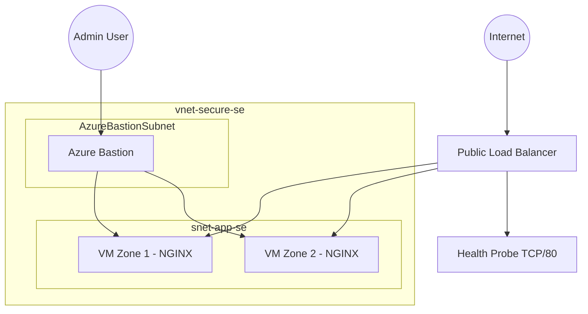
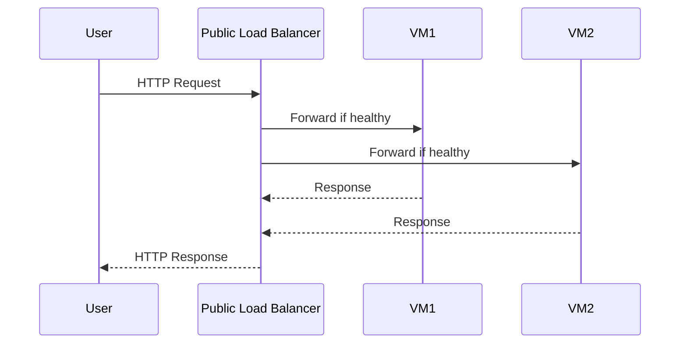

# Azure Secure Connectivity & High Availability Architecture

## 🎯 Executive Summary

This project demonstrates the design and deployment of a secure and highly available Azure infrastructure using Infrastructure as Code (Bicep).

It reflects architectural reasoning, operational validation, high availability design, and layered security implementation under real-world constraints.

---

# 🏗 Full Deployment Overview

### 📊 Azure Portal – Complete Deployment View

### 🌐 Virtual Network Topology

---

# 🧱 Architecture Components

| Component | Purpose | Security Impact |
|------------|----------|----------------|
| Virtual Network | Network isolation boundary | Segmentation layer |
| App Subnet | Hosts workload VMs | Controlled east-west traffic |
| Azure Bastion | Secure administrative access | Eliminates public SSH exposure |
| Standard Load Balancer | Traffic distribution | Centralized public entry point |
| Network Security Group | Traffic filtering | Default deny model |
| Multi-Zone VMs | High availability | Protection against zone failure |

---

# 🧠 Logical Architecture

# Traffic Flow Diagram

---

# 🔐 Security Posture Assessment

## 🎯 Objective

This document evaluates the security posture of the deployed Azure architecture, focusing on:

- Attack surface exposure  
- Network isolation  
- Access control mechanisms  
- Residual risks  
- Enterprise improvement paths  

---

# 🏛 Security Architecture Overview

| Layer | Control Implemented | Security Function |
|-------|--------------------|------------------|
| Network Segmentation | Virtual Network + Subnets | Isolation boundary |
| Traffic Filtering | Network Security Groups | Controlled inbound/outbound traffic |
| Access Control | Azure Bastion | No direct public SSH |
| Traffic Distribution | Load Balancer | Backend abstraction |
| High Availability | Multi-Zone Deployment | Resilience against zone failure |

---

# 🔑 Administrative Access Model

## Access Flow

User → Azure Bastion (443) → Private VM (22)

### Controls in Place

| Control | Implementation | Risk Mitigated |
|----------|---------------|---------------|
| No Public IP on VMs | Bastion-only SSH | Brute-force attacks |
| SSH Key Authentication | Public key injection | Password compromise |
| Dedicated Bastion Subnet | Network isolation | Lateral exposure |
| Default Deny NSG | Implicit rule 65500 | Accidental exposure |

### Security Impact

- Administrative surface significantly reduced  
- No direct port 22 exposure to Internet  
- Access path centralized  

---

# 🌐 Application Exposure Model

## Traffic Flow

Internet → Public Load Balancer → Backend Pool → VM

### Controls in Place

| Control | Implementation | Risk Mitigated |
|----------|---------------|---------------|
| Public IP only on LB | No VM public IP | Direct scanning |
| Health Probe | TCP/80 monitoring | Fault isolation |
| NSG Port Rule | Explicit port 80 allow | Controlled exposure |
| Default Deny | Implicit deny | Overexposure |

### Observations

- Only one public entry point exists  
- Backend VMs are abstracted  
- Layer 4 distribution implemented  

---

# 🛡 Attack Surface Review

## Exposed Endpoints

| Endpoint | Port | Protection Level |
|----------|------|-----------------|
| Load Balancer Public IP | 80 (HTTP) | Basic (NSG filtered) |
| Bastion Public Endpoint | 443 | Encrypted TLS |

## Non-Exposed Components

- No public VM IP  
- No public SSH  
- No unnecessary inbound ports  

---

# ⚠ Residual Risks

| Risk | Impact | Current Status |
|------|--------|---------------|
| HTTP Unencrypted | MITM possible | Not mitigated |
| No WAF | No L7 inspection | Not implemented |
| No DDoS Standard | Basic network protection only | Not implemented |
| No Central Logging | Limited visibility | Not implemented |
| No Defender for Cloud | Reduced threat detection | Not enabled |

---

# 📊 Security Maturity Assessment

| Area | Level |
|------|--------|
| Network Isolation | Strong |
| Access Restriction | Strong |
| Encryption | Weak (HTTP only) |
| Monitoring | Minimal |
| Threat Protection | Basic |

Overall Classification:

**Secure Lab / Pre-Production**

---

# 🚀 Enterprise Hardening Roadmap

| Enhancement | Security Benefit |
|--------------|------------------|
| Azure Application Gateway (WAF) | Layer 7 inspection |
| HTTPS + TLS Termination | Confidentiality & integrity |
| Azure DDoS Protection Standard | Volumetric protection |
| Azure Monitor + Log Analytics | Visibility & detection |
| Microsoft Defender for Cloud | Threat intelligence |
| RBAC Least Privilege | Governance control |
| Conditional Access + MFA | Identity security |

---

# 🧠 Zero Trust Alignment

| Principle | Status |
|------------|--------|
| Explicit Deny by Default | Implemented |
| Minimized Attack Surface | Implemented |
| Identity-Based Access | Partial |
| Continuous Monitoring | Not implemented |
| Encryption Everywhere | Not implemented |

---

# 🏁 Final Assessment

The current architecture significantly reduces exposure compared to a default public VM deployment.

It demonstrates:

- Layered network isolation  
- Controlled administrative access  
- High availability awareness  
- Explicit filtering logic  

However, enterprise-grade security requires:

- TLS encryption  
- Layer 7 inspection  
- Threat detection  
- Centralized monitoring  

The architecture is suitable for lab validation and can evolve toward production readiness with structured enhancements.