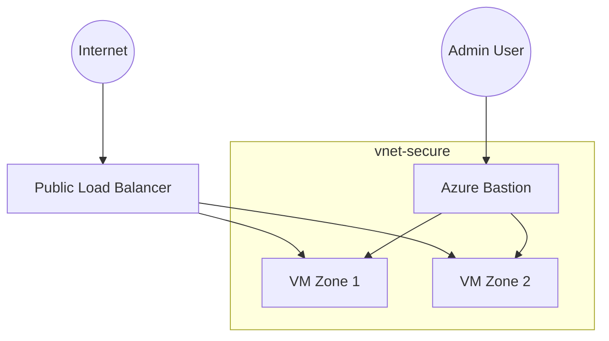

# 🔐 Azure Secure Connectivity Architecture

## Overview

This project demonstrates a **secure and highly available Azure infrastructure architecture**, implemented using **Infrastructure as Code with Terraform**.

The architecture focuses on three key objectives:

* Secure administrative access without exposing virtual machines
* High availability using **multi-zone deployment**
* Controlled public exposure through a **centralized entry point**

---

# 🏗 Architecture Overview

### High-Level Deployment (Azure Portal)


### Network Topology (Azure VNet View)


---

# 🧠 Architecture Walkthrough

## Public Traffic Flow

External traffic enters the infrastructure through a **Public Azure Load Balancer**.

Traffic flow:

Internet → Load Balancer → Backend Virtual Machines

The load balancer distributes incoming traffic across virtual machines deployed in different availability zones, providing:

* Improved availability
* Resilience to zone failures
* Basic load distribution across backend instances

---

## Administrative Access

Administrative access to the virtual machines is secured using **Azure Bastion**.

Access flow:

Administrator → Azure Bastion → Private Virtual Machines

Benefits of this model:

* No direct SSH exposure to the Internet
* Reduced attack surface
* Centralized administrative access point

---

# Core Components

| Component              | Purpose                      |
| ---------------------- | ---------------------------- |
| Virtual Network        | Network isolation boundary   |
| Application Subnet     | Hosts backend VMs            |
| Azure Bastion          | Secure administrative access |
| Public Load Balancer   | Single public entry point    |
| Network Security Group | Traffic filtering            |
| Multi-Zone VMs         | High availability            |

---

# 🧠 Logical Architecture



---

# 🔐 Security Model

The architecture follows a **defense-in-depth approach**:

* No public IP assigned to virtual machines
* Bastion-based administrative access
* Network Security Groups enforcing traffic filtering
* Default deny inbound model

Public exposure is limited to:

| Endpoint      | Port | Purpose               |
| ------------- | ---- | --------------------- |
| Load Balancer | 80   | Application traffic   |
| Bastion       | 443  | Secure administration |

---

# ⚙️ Infrastructure as Code

Infrastructure deployment is implemented using **Terraform**.

The repository also includes an earlier **Bicep implementation** for comparison between:

* Azure-native IaC
* Cloud-agnostic IaC

---

# 📂 Repository Structure

```
docs/
  architecture/
  security/
  operations/
  adr/

diagrams/

terraform/
  modules/
  environments/

bicep/
```

---

# 🚀 Deployment

Initialize Terraform:

```
terraform init
```

Validate configuration:

```
terraform validate
```

Generate execution plan:

```
terraform plan
```

Deploy infrastructure:

```
terraform apply
```

---

# 📖 Documentation

Detailed architecture analysis and security assessment are available in:

```
docs/
```

The documentation includes:

* Architecture analysis
* Security evaluation
* Threat modeling
* Operational troubleshooting
* Architecture decision records (ADR)

---

# 🎯 Project Purpose

This project demonstrates:

* Cloud architecture design
* Infrastructure as Code best practices
* Secure administrative access patterns
* High availability design in Azure

It serves as a **cloud architecture case study and portfolio project**.
