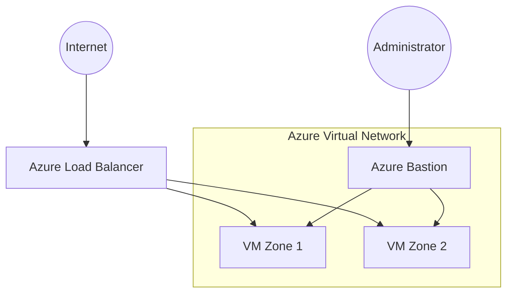

# 🔐 Azure Secure Connectivity – Architecture Case Study

## 🎯 Executive Summary

This project demonstrates the design and deployment of a secure Azure infrastructure using **Bicep** as the Infrastructure as Code solution.

The architecture focuses on secure administrative access, high availability and controlled public exposure while applying cloud security best practices commonly used in enterprise environments.

---

# 📌 Business Context

Many enterprise workloads require virtual machines while minimizing their exposure to the Internet.

This architecture explores how Azure networking and security services can be combined to provide secure administration, resilient connectivity and a scalable foundation for production-ready workloads.

---

# ☁ Azure Services Used

- Azure Virtual Network
- Azure Bastion
- Azure Load Balancer
- Azure Virtual Machines
- Network Security Groups (NSG)
- Availability Zones
- Public IP
- Resource Groups
- Bicep (Infrastructure as Code)

---

# 🏗 Architecture Overview

The infrastructure is deployed entirely using **Bicep**, Microsoft's native Infrastructure as Code language.

The solution follows a layered networking approach where public traffic is centralized through an Azure Load Balancer while administrative access is secured using Azure Bastion.

### Architecture Goals

- Secure remote administration
- High availability across Availability Zones
- Controlled public exposure
- Network isolation
- Repeatable infrastructure deployment

---

# 🏛 Architecture Principles

The architecture is based on several fundamental cloud architecture principles:

- Security by Design
- Infrastructure as Code
- Defense in Depth
- High Availability
- Least Privilege Access
- Network Segmentation

---

# 🧠 Logical Architecture



---

## 🔄 Traffic Flow

### Application Traffic

Internet

↓

Azure Load Balancer

↓

Virtual Machines

---

### Administrative Traffic

Administrator

↓

Azure Bastion

↓

Private Virtual Machines

---

# 📌 Core Components

| Component | Purpose |
|-----------|---------|
| Azure Virtual Network | Network isolation |
| Application Subnet | Backend workload hosting |
| Azure Bastion | Secure VM administration |
| Azure Load Balancer | Centralized public entry point |
| Network Security Group | Traffic filtering |
| Availability Zones | High availability |
| Bicep | Infrastructure provisioning |

---

# 🔐 Security Assessment

Current Security Level

**Production-inspired**

Implemented

- No Public IP on Virtual Machines
- Azure Bastion administration
- Network Security Groups
- Centralized public entry point
- Availability Zones
- Defense-in-Depth approach

Current Limitations

- No Azure Firewall
- No Azure DDoS Protection Standard
- No Private DNS
- No Azure Policy
- No Azure Monitor integration

---

# 📌 Design Decisions

| Decision | Rationale |
|----------|-----------|
| Azure Bastion | Secure remote administration |
| Load Balancer | Single controlled public endpoint |
| Availability Zones | Improve workload resilience |
| NSGs | Fine-grained traffic filtering |
| Bicep | Azure-native Infrastructure as Code |

---

# ⚖️ Architecture Trade-Offs

| Decision | Benefit | Trade-off |
|----------|----------|-----------|
| Azure Bastion | Secure administration | Additional cost |
| Load Balancer | High availability | Added infrastructure complexity |
| Availability Zones | Improved resilience | Higher deployment cost |
| Bicep | Native Azure integration | Azure-specific language |

---

# 🚀 Production Evolution Roadmap

```text
Secure Connectivity
        │
        ▼
Monitoring
        │
        ▼
Governance
        │
        ▼
Automation
        │
        ▼
Landing Zone Integration
```

---

## Phase 1 — Observability

- Azure Monitor
- Log Analytics
- Diagnostic Settings
- Alerts

---

## Phase 2 — Governance

- Azure Policy
- Resource Locks
- RBAC refinement
- Tagging strategy

---

## Phase 3 — Security

- Azure Firewall
- Private DNS
- DDoS Protection Standard
- Defender for Cloud

---

## Phase 4 — Enterprise Integration

- Landing Zone alignment
- Shared Services integration
- Centralized Monitoring
- CI/CD pipeline

---

# 📚 Key Takeaways

This project demonstrates:

- Secure Azure networking
- Infrastructure as Code with Bicep
- Secure administrative access
- High Availability design
- Defense-in-Depth principles
- Enterprise networking fundamentals

---

# 🔭 Future Learning Direction

Future improvements may include:

- Azure Firewall
- Private Endpoints
- Azure Policy
- Landing Zones
- Azure Monitor
- Defender for Cloud
- Hub-and-Spoke integration

---

# 💡 Architect's Perspective

Secure connectivity is a fundamental building block of every enterprise cloud platform.

This project demonstrates how networking, security and Infrastructure as Code work together to create a secure and scalable Azure foundation.

While intentionally focused on core networking concepts, the architecture establishes patterns that can be extended toward enterprise landing zones, shared services and cloud-native workloads.
