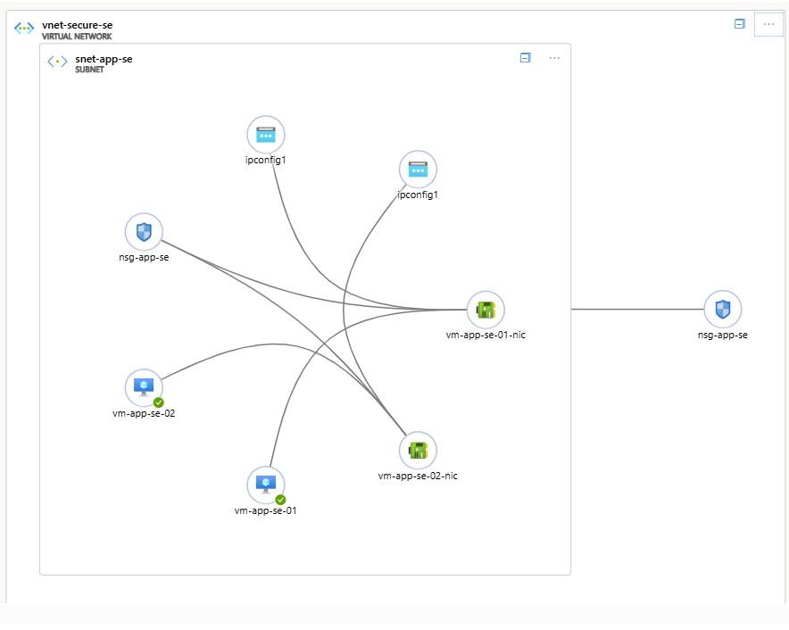
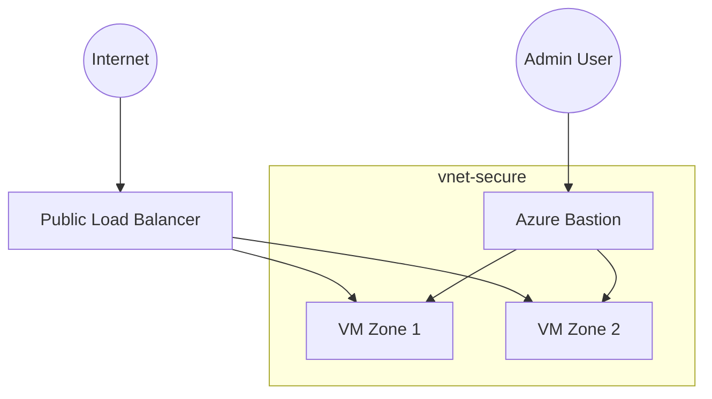

# 🔐 Azure Secure Connectivity Architecture

## Overview

This project demonstrates a secure and highly available infrastructure architecture on Microsoft Azure, implemented using Infrastructure as Code with Terraform.

The architecture focuses on three key objectives:

* Secure administrative access without exposing virtual machines
* High availability using multi-zone deployment
* Controlled public exposure through a centralized entry point

---

## 🏗 Architecture Overview

### High-Level Deployment(Azure Portal)


### Network Topology (Azure Vnet View)



---

## Core Components

| Component              | Purpose                      |
| ---------------------- | ---------------------------- |
| Virtual Network        | Network isolation boundary   |
| Application Subnet     | Hosts backend VMs            |
| Azure Bastion          | Secure administrative access |
| Public Load Balancer   | Single public entry point    |
| Network Security Group | Traffic filtering            |
| Multi-Zone VMs         | High availability            |
---
## 🧠 Logical Architecture



---

## 🔐 Security Model

The architecture follows a defense-in-depth approach:

* No public IP assigned to virtual machines
* Bastion-based administrative access
* Network Security Groups enforcing traffic filtering
* Default deny inbound model

Public exposure is limited to:

| Endpoint      | Port | Purpose               |
| ------------- | ---- | --------------------- |
| Load Balancer | 80   | Application traffic   |
| Bastion       | 443  | Secure administration |
---
## ⚙️ Infrastructure as Code

Infrastructure deployment is implemented using Terraform.

The repository also includes an earlier Bicep implementation for comparison.

---

## 📂 Repository Structure
```
docs/
  architecture/
  security/
  operations/

diagrams/

terraform/

bicep/
```

---

## 📖 Documentation
Detailed architecture analysis and security assessment are available in:

```
docs/
```

